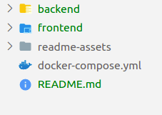
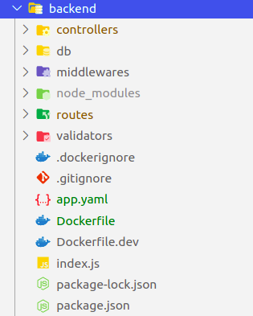
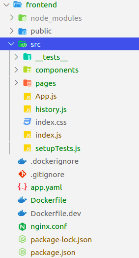

# Quick Start
You can run the whole App setup using only

`docker-compose up --build`

This will run three services: frontend, backend and database

You can interact with the th frontend (React) by going to `localhost:3000` in your bowser. At the begining there will be no data and you will need to create a phone data by click on the (+) button.

# The Project Structure

### Project's root

includes the backend api (Nodejs) folder, the frontend app (React), readme-assets for the README.md images, docker-compose.yml which include the whole app local orchestration for local development.

## backend

Includes:

* **index.js** : the entrance to the REST
* **package.json** : has all the dependencies that the app needs to run
* **Dockerfile.dev** : docker file that's used with docker-compose for local development
* **Dockerfile** : production docker file
* **app.yaml** : file used to deploy to [Google App Engine](https://cloud.google.com/appengine) using docker containers
* **validators** : folder includes functions that validate data before writing them to the database
* **routes** : different routes' endpoints for the API resources
* **middlewares** : includes for now just the error handling middleware for the API
* **db** : contains the configuration for my chosen database which is [Google Firestore](https://cloud.google.com/firestore) a NoSQL database.
* **controllers** : includes functions to handle the database manipulation upon specific resource and endpoint request

## frontend

includes:

* **public** : index.html and other app assets
* **app.yaml** : file used to deploy to [Google App Engine](https://cloud.google.com/appengine) using docker containers
* **Dockerfile.dev** : docker file that's used with docker-compose for local development
* **Dockerfile** : production docker file
* **nginx.conf** : nginx configuration file that's need when creating the production ready frontend app like react.
* **package.json** : has all the dependencies that the app needs to run
* **src** : the App source code

### frontend/src

* **__tests__** : has some app level test like integration tests
* **components**: the components that form the app. devided into folders that contain the component jsx file, the style css file and another folder `__tests__` which includes tests specific to that component (unit tests).
* **pages** : high level components that form the pages of the app.
* **history** : contains the configuration for history react-router-dom. done like this to make testing easier and to have a better control on the app.
* **index.js** : entry to the app.
* **setupTests.js** : configuration for testing setup

# Deployment

The App is deployed on [Google App Engine](https://cloud.google.com/appengine) both the frontend and the backend.

Backend: *********************************

Frontend: *********************************

## How to use the REST API

Endpoint are:

`GET /api/v1/phones --> get list of phones`

`GET /api/v1/phones/:phoneid --> get a specific phone`

`POST /api/v1/phones --> create a new phone`

`PUT /api/v1/phones/:phoneid --> update an existing phone`

`DELETE /api/v1/phones/:phoneid --> delete an existing phone`

# What else I would add

* Add image upload functionality from the frontend.
* Use Redux for state management
* Fully test the app for frontend and backend
* Add authentication
* Deploy to kubernetes
* use Typescript to avoid bugs
* some code cleaning
